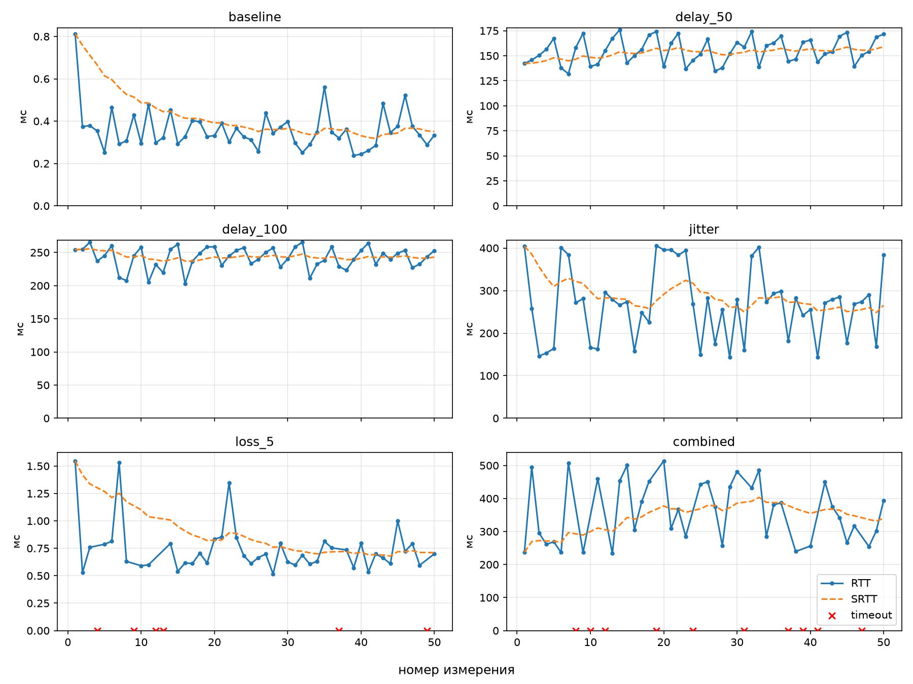
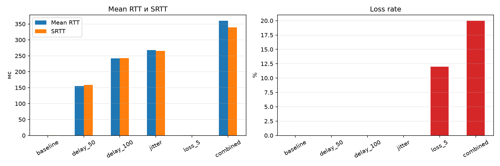
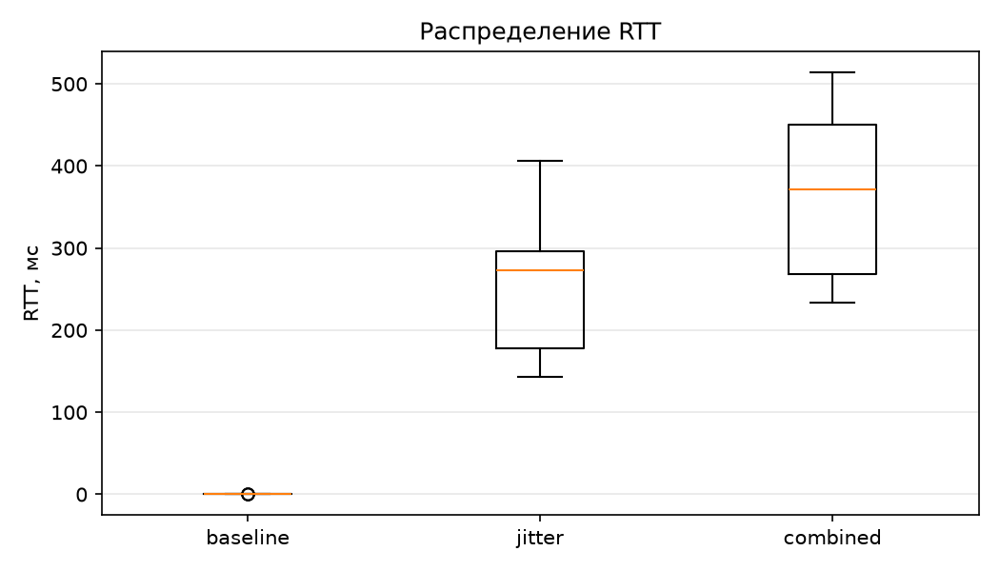

# Отчёт об измерении задержки UDP-соединения

## 1. Цель и метод

Цель работы — измерить RTT между клиентом и сервером, оценить сглаженный RTT,
джиттер и долю потерь в шести сетевых условиях.

Клиент отправляет `PING` с порядковым номером и запоминает время отправки по
монотонным часам (`std::chrono::steady_clock`). Сервер отвечает `PONG` с тем
же номером. Клиент фиксирует время получения и считает:

- `RTT = t_receive − t_send`, обе метки сняты по часам клиента;
- `SRTT = 0.875 · SRTT + 0.125 · RTT`, первое измерение инициализирует SRTT;
- джиттер `J = 1/(n−1) · Σ|RTT_i − RTT_{i−1}|` по полученным ответам;
- потери `Loss = N_timeout / N_sent · 100%`.

`PING` без ответа дольше 1000 мс получает статус `timeout`. Повторная отправка
не выполняется.

## 2. Условия эксперимента

Полная конфигурация приведена в [Experiment_Config.md](Experiment_Config.md).
Кратко: клиент и сервер на одной машине (127.0.0.1:54000), Windows 11,
эмулятор Clumsy 0.3 с фильтром `outbound and udp.DstPort == 54000`, в каждой
серии 50 `PING` с интервалом 200 мс. Исходные данные —
[latency_samples.csv](latency_samples.csv), 300 измерений.

Фактический интервал между отправками составил в среднем 200.1–200.3 мс при
разбросе от 185 до 214 мс.

## 3. Результаты

| Серия | Отпр. | Получ. | Тайм-аут | Min, мс | Max, мс | Mean, мс | Median, мс | SRTT, мс | Джиттер, мс | Потери, % |
|---|---|---|---|---|---|---|---|---|---|---|
| baseline | 50 | 50 | 0 | 0.238 | 0.813 | 0.359 | 0.339 | 0.351 | 0.091 | 0 |
| delay_50 | 50 | 50 | 0 | 132.011 | 175.919 | 155.189 | 154.614 | 158.870 | 13.884 | 0 |
| delay_100 | 50 | 50 | 0 | 203.045 | 265.699 | 242.103 | 244.898 | 242.990 | 18.092 | 0 |
| jitter | 50 | 50 | 0 | 143.107 | 405.833 | 267.594 | 272.491 | 265.361 | 77.645 | 0 |
| loss_5 | 50 | 44 | 6 | 0.516 | 1.547 | 0.742 | 0.693 | 0.710 | 0.193 | 12 |
| combined | 50 | 40 | 10 | 233.680 | 513.919 | 360.312 | 370.925 | 339.615 | 110.853 | 20 |

SRTT указан на конец серии. Ответов со статусами `late_response`,
`duplicate_response` и `unknown_response` не было ни в одной серии.

### RTT по измерениям

### Средний RTT, SRTT и потери

### Распределение RTT

## 4. Анализ

### Базовая задержка

Без ограничений RTT на loopback составляет 0.24–0.81 мс при медиане 0.34 мс.
Первое измерение серии (0.813 мс) более чем вдвое выше остальных: это
«холодный» первый обмен. Поскольку первое RTT инициализирует SRTT, оценка
оказывается завышенной и сходится к типичному значению примерно за 15
измерений. Это свойство выбранной формулы: один выброс в начале влияет на
SRTT дольше, чем такой же выброс в середине серии.

### Вносимая задержка

Фактическая прибавка RTT заметно больше заданной в Clumsy:

| Серия | Задано, мс | Прибавка к RTT, мс | Отношение |
|---|---|---|---|
| delay_50 | 50 | 154.8 | 3.1 |
| delay_100 | 100 | 241.7 | 2.4 |

Прибавка не пропорциональна настройке: увеличение Lag на 50 мс добавило около
87 мс. Это согласуется с моделью «задержка применяется к пакету дважды плюс
постоянная добавка в 40–55 мс», но экспериментом такая модель не проверялась.
Возможные причины — особенности перехвата loopback-трафика драйвером WinDivert
и дискретность таймера, по которому Clumsy выпускает задержанные пакеты.

В пользу дискретности говорит форма графика `delay_50`: RTT растёт ступенями
от 132 до 176 мс и сбрасывается, образуя «пилу» с периодом 4–5 измерений.
Такая картина возникает, когда интервал отправки (200 мс) не кратен периоду
обработки в эмуляторе. По этой же причине даже постоянная задержка даёт
ненулевой джиттер: 13.9 мс при Lag 50 и 18.1 мс при Lag 100 против 0.09 мс в
базовой серии.

Вывод для дальнейших работ: значение Lag в Clumsy нельзя считать фактической
задержкой канала, её нужно измерять.

### Джиттер

В серии `jitter` (Lag 50 + Throttle 100 мс, 50%) RTT меняется от 143 до
406 мс, джиттер 77.6 мс. Целевой диапазон 50–150 мс не достигнут, значения
выше по той же причине, что и в сериях с задержкой.

Значения RTT группируются около трёх уровней: примерно 150, 270 и 400 мс.
Throttle не задерживает пакет на случайное время, а накапливает пакеты и
выпускает их пачкой, поэтому задержка принимает дискретные значения.

SRTT в этой серии менялся в пределах 248–404 мс при разбросе RTT 143–406 мс и
после начального выброса (первое измерение 404 мс) держался около 250–330 мс.
Сглаживание подавляет отдельные скачки, но на группу из пяти высоких значений
подряд (измерения 19–23) SRTT отреагировал ростом с 258 до 324 мс.

### Потери

| Серия | Задано, % | Потеряно | Доля, % | 95% доверительный интервал, % |
|---|---|---|---|---|
| loss_5 | 5 | 6 из 50 | 12 | 5.6–23.8 |
| combined | 5 | 10 из 50 | 20 | 11.2–33.0 |

Наблюдаемая доля потерь выше заданной в 2.4 и 4 раза. Для `loss_5` при
истинной вероятности 5% шесть и более потерь из 50 выпадают примерно в 4%
случаев, то есть результат маловероятен, но не исключён. Для `combined`
десять потерь при 5% практически невозможны (вероятность около 0.02%).

Если пакет проходит через модуль Drop дважды, ожидаемая доля потерь равна
`1 − 0.95² ≈ 9.75%`. С этой величиной результат `loss_5` согласуется хорошо,
результат `combined` — хуже (вероятность около 2%). Не исключено, что в
комбинированной серии часть пакетов дополнительно отбрасывает Throttle.

При 50 пакетах доверительный интервал слишком широк, чтобы различить эти
гипотезы. Для надёжной оценки потерь нужна серия из нескольких сотен пакетов.

Все тайм-ауты — настоящие потери: поздних ответов не зафиксировано, а
максимальный RTT (514 мс) вдвое меньше тайм-аута. В `loss_5` есть две потери
подряд (измерения 12 и 13), что нужно учитывать при проектировании повторных
передач.

В `loss_5` RTT полученных пакетов (медиана 0.69 мс) вдвое выше базового
(0.34 мс): перехват пакетов эмулятором сам добавляет около 0.35 мс, даже когда
задержка не настроена.

### Комбинированная серия

Сочетание задержки, джиттера и потерь даёт худшие показатели по всем метрикам:
средний RTT 360 мс, джиттер 111 мс, потери 20%. Из-за тайм-аутов SRTT
обновляется реже (40 раз вместо 50) и к концу серии (340 мс) отстаёт от
среднего RTT на 20 мс.

### Некорректные ответы

Статусы `late_response`, `duplicate_response` и `unknown_response` в
эксперименте не возникли: Clumsy в выбранных настройках не дублирует пакеты, а
задержки не превышают тайм-аут. Обработка этих случаев проверена
автоматическими тестами (`tests/telemetry_tests.cpp`).

## 5. Тайм-аут

Значение 1000 мс подтверждено данными: максимальный RTT за весь эксперимент
равен 514 мс, ложных тайм-аутов (поздних ответов) нет. Запас относительно
худшего случая — около двух раз.

## 6. Ограничения

- Клиент и сервер работают на одной машине, реальная сеть не участвует.
- Фактические задержка и потери отличаются от настроек Clumsy; причины
  сформулированы как гипотезы и отдельно не проверялись.
- 50 измерений достаточно для оценки RTT, но мало для оценки потерь.
- Clumsy не позволяет задать seed, серии с потерями точно не воспроизводятся.
- Каждая серия снята один раз.

## 7. Выводы для ПР №3

1. Фиксированный тайм-аут повторной передачи плохо подходит для всех условий
   сразу: в базовой серии ответ приходит за 0.4 мс, в комбинированной — за
   время до 514 мс. Тайм-аут стоит вычислять от SRTT.
2. Одного SRTT недостаточно. В серии `combined` SRTT равен 340 мс, а RTT
   доходит до 514 мс: повтор по тайм-ауту, равному SRTT, срабатывал бы на
   пакетах, которые ещё в пути. Нужен запас, зависящий от разброса, например
   `RTO = SRTT + 4 · J`: для `combined` это около 780 мс, что покрывает все
   наблюдавшиеся RTT.
3. Для быстрых соединений нужна нижняя граница тайм-аута: в базовой серии та
   же формула даёт меньше 1 мс, что сравнимо с погрешностью таймеров.
4. Потери идут в том числе подряд, поэтому одной повторной попытки может не
   хватить.
5. Дубликаты неизбежно появятся после введения повторных передач, и статус
   `duplicate_response` начнёт встречаться в реальных сериях.
